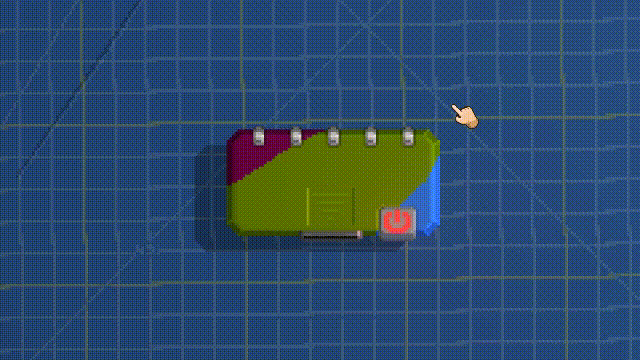
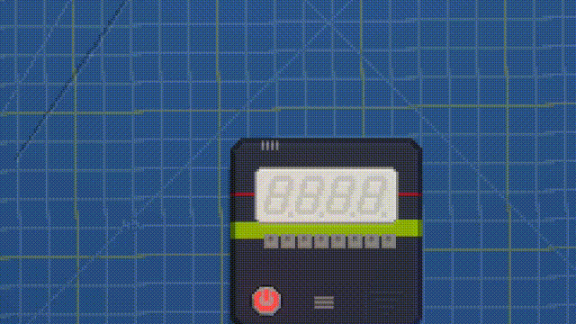
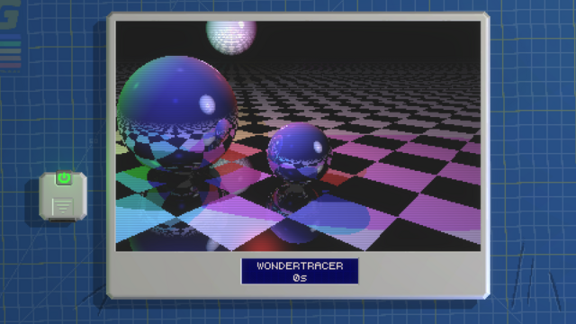

# Retro Gadgets TypeScript Examples

---

A repository collecting sample projects to show the utilization of TypeScript for retro gadgets.
Each example should include the finished gadget.

## 1: Lamp Flipper

`examples/lamp-flipper` changes the state based on the time of the CPU. Serves
as simple introduction how to write and declare components.

## 2: Binary Counter

`examples/binary-counter` is a binary counter that resets when the Gadget turns
off. It is an example how / that binary operations work. 

## 3: Raytracer

`examples/raytracer` ports the [TypeScript raytracer demo from Microsoft][1]

[1]: https://www.typescriptlang.org/Sample/raytracer/raytracer.html